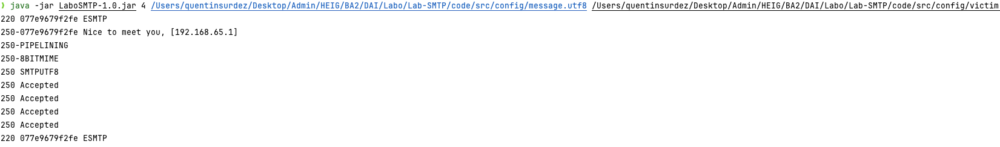

# Report Lab SMTP

Authors: Quentin Surdez, Rachel Tranchida

## Table of contents

- [Description](#description)
- [MailDev](#maildev)
- [Installation](#installation)
  - [Technical Needs](#technical-needs)
  - [Java Project](#java-project)
  - [SMTP Server](#smtp-server)
- [Configuration](#configuration)
- [Execution](#execution)
- [Implementation](#implementation)
  - [Classes](#classes)
  - [Examples](#examples)


## Description

This git repository contains the fourth laboratory from DAI HEIG. The purpose of this lab is to build a SMTP client
using the SMTP protocol. This project can create pranks emails. The user can create a list of email addresses in a 
config file as well as a list of messages in another config file. The program will create groups from 2-5 email 
addresses and will send randomly emails to each of the group.

So that we don't cross any legal boundaries, we're using MailDev to create a local SMTP server. A docker configuration 
has been created to facilitate the use of the server.

## MailDev

We're using the MailDev so that we can test the application. This tool is located [here](https://github.com/maildev/maildev).

MailDev is a simple way to test this project's generated emails. The environment is secure as it is host locally.

## Installation

### Technical Needs

The following list must be installed on your machine for this project to work: 

- Java with >= jdk21
- Maven
- Docker

### Java Project

The project in the `code` directory can be compiled very easily as it uses `Maven`. You need to write the following commands:

```shell
mvn clean package
cd target
java -jar LaboSMTP-1.0.jar
```

### SMTP Server

Launching the SMTP server has been made very easy thanks to a script. You just need to go to the `docker` directory and write the 
following command: 

```bash
./run_container.sh
```

This script binds the ports 1080 and 1025 of your machine with the corresponding ports of the container.

- the port 1025 is the SMTP server
- the port 1080 is the web interface

## Configuration

When you have compiled the project, you can change the files in `code/src/config`. These files are the ones containing
the list of email addresses and the messages you want to use with the application. 

- The file `message.utf8` contains the messages you want to send. You need to respect a certain syntax in order for this
file to be readable. As its extension suggests it needs to be encoded in utf8. 

```shell
Subject: [YOUR INPUT]

[YOUR INPUT]

$$
Subject: [YOUR INPUT]

[YOUR INPUT]

$$
```
- The file `victims.utf8` contains email addresses separated by a backspace. As its extension suggests it needs to be encoded in utf8.

## Execution

When everything is set up, you can run the application via this command, you need to give the number of groups wanted and 
the path to your config files. You need to respect the following order for the pathfile. First the message.utf8 file, then
the victim.utf8 file. We recommend you to give the absolute path: 

```shell
java -jar LaboSMTP-1.0.jar 5 /Users/quentinsurdez/Desktop/Admin/HEIG/BA2/DAI/Labo/Lab-SMTP/code/src/config/message.utf8 \
/Users/quentinsurdez/Desktop/Admin/HEIG/BA2/DAI/Labo/Lab-SMTP/code/src/config/victim.utf8
 
```

You will have to go to [localhost:1082](http://localhost:1082) to see the web interface and check if the mails have been
received. 

## Implementation


### Classes

We have first started by brainstorming about how to implement the given laboratory with classes in java. We have come up
with this UML which has been our guideline for coding. In this section we will discuss the purpose behind each of the 
different classes. 

**Class Victim**
This class represents the victims of the email prank. This class stores only the email of the victim. We've implemented
it nonetheless for we decided that it will be better if the project grows beyond its current purposes.

**Class Group**
This class represents the group to which the email will be sent. The sender and the victims as well as the message is 
stored within it.

**Class Message**
This class represents the message that will be sent to the group. It contains a subject and a body. These are essential 
parts of the Mail class.

**Class Mail**
This class represents the mail that will be sent to different email addresses from a specific email address. We have decided
to generalise this class by not putting our created classes in it. We have chosen an `ArrayList<String>` to represent
the recipients instead of `ArrayList<Victim>`. This choice is backed up by the desire to make this class reusable for other
purposes.

**Class Prank**
This class represents a prank. It contains a list of groups, each group contains a sender, a list of victims and a message.
The number of groups is given in the constructor, and the list of victims and messages are given in the constructor. For each group 2-5 email
adresses are chosen randomly from the list of victims. The first email address is the sender, and the others are the victims. The message is also chosen randomly.

**Class FileManager**
This class allows to handle our different config files. It permits the extraction of the data stored inside those file. 
We then construct the different classes according to their constructors.

**Class SmtpClient**
This class is the representation of our SMTP client. It allows us to send mails to a SMTP server by connecting to it and 
handling the different procedures it needs to handle.

### Examples

Here is an example of the use of the server: 



Here are the emails received by the SMTP server on the web interface.


